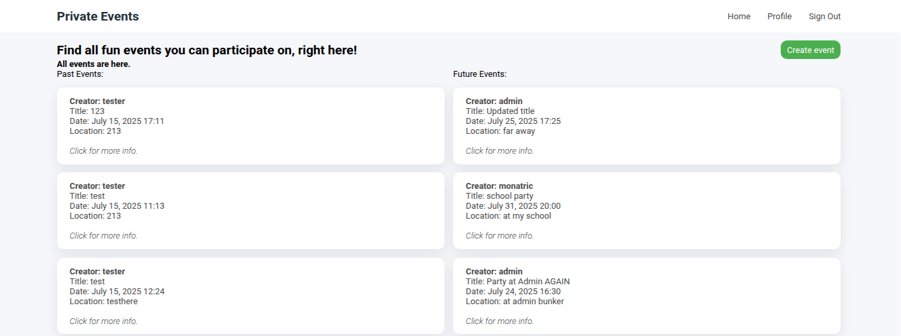
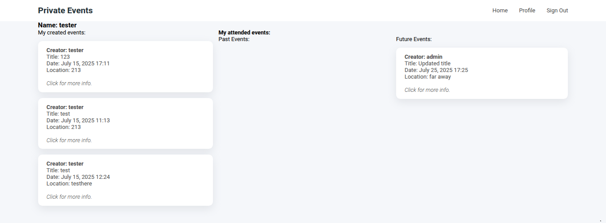
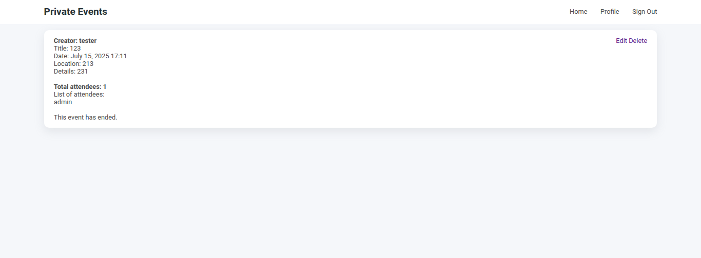
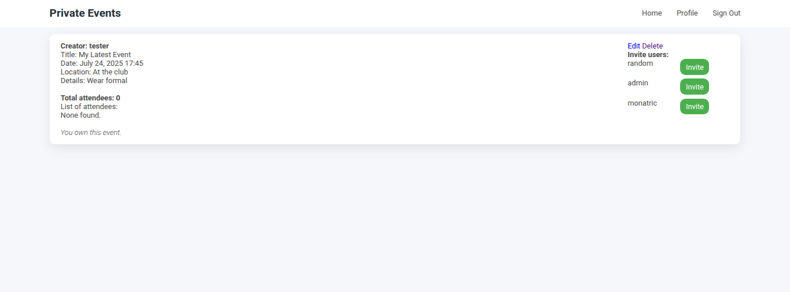
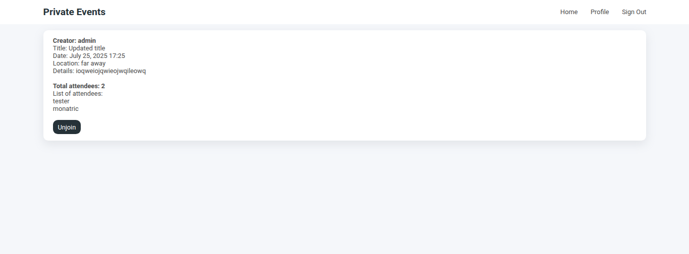

# Project: Private Events

This project has similar functionalities to [EventBrite](https://www.eventbrite.com/) which allows users to create events and manage user registrations.

A user can create events. A user can attend many events. An event can be attended by many users. Events take place at a specific date and at a location (which you can just store as a string, like “Andy’s House”).

This project will require me to model many-to-many relationships and also to be very conscious about my foreign keys and class names. The learning outcome of this project should enable me to strongly grasp Active Record Associations and Queries.

The project is guided by the Rails course in [TheOdinProject](https://www.theodinproject.com/lessons/ruby-on-rails-private-events).

## Learning Outcomes

- Used Devise gem to handle authentication.
- I practiced writing models and migrations for many-to-many relationships with `:through`, with a self-referential association.
- Added model methods and scopes to find out more about queries and relations.
- Created view event helpers and view conditionals based on varying user's state. This includes status of invitation whether or not the user can join, unjoining, inviting users as the owner, and using the scopes and model methods for past and future events and invitation existence.
- Built user profile to show created events, resourceful routes, and RESTful controller actions.
- Reduced repetitive codes in views by building partials and rendering them.

## Screenshots

### Root page

### Profile page

### Event Show page (with varying user and event date status)

